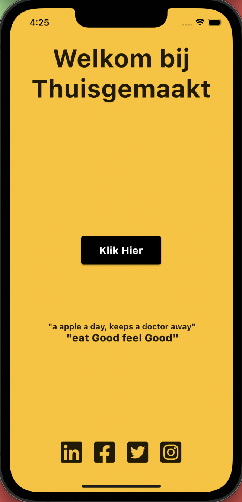
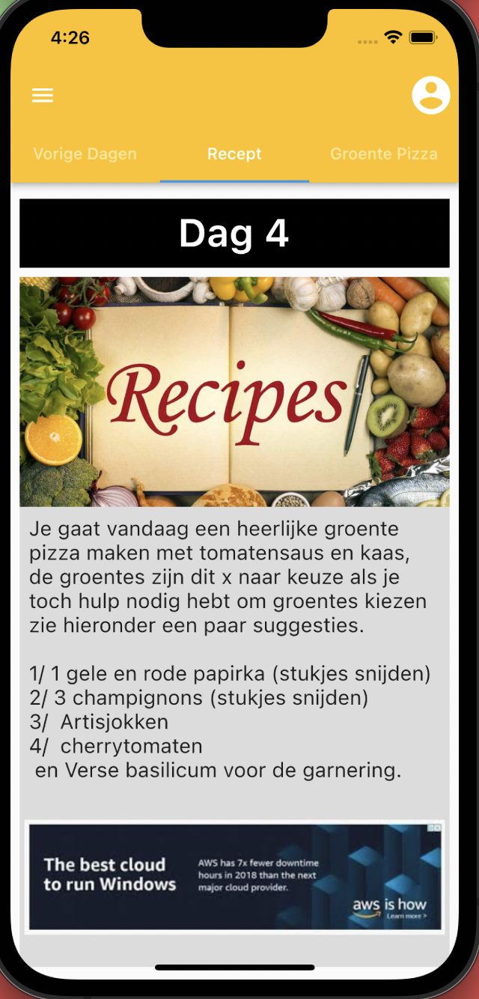
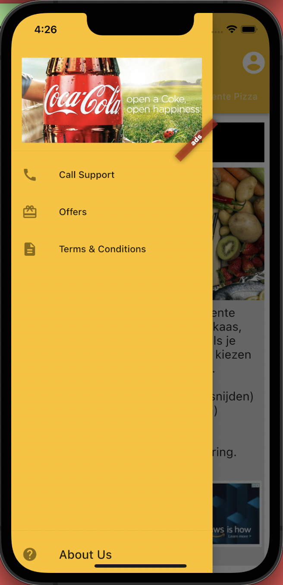
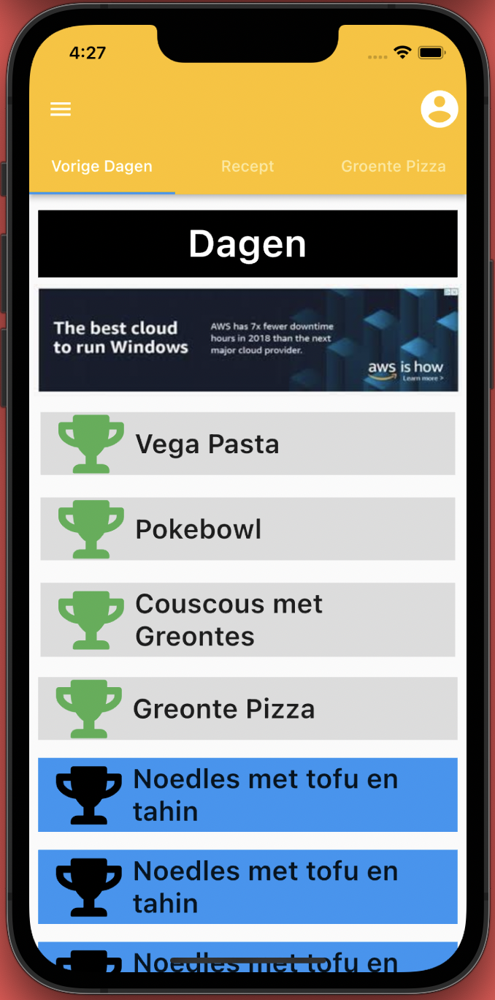
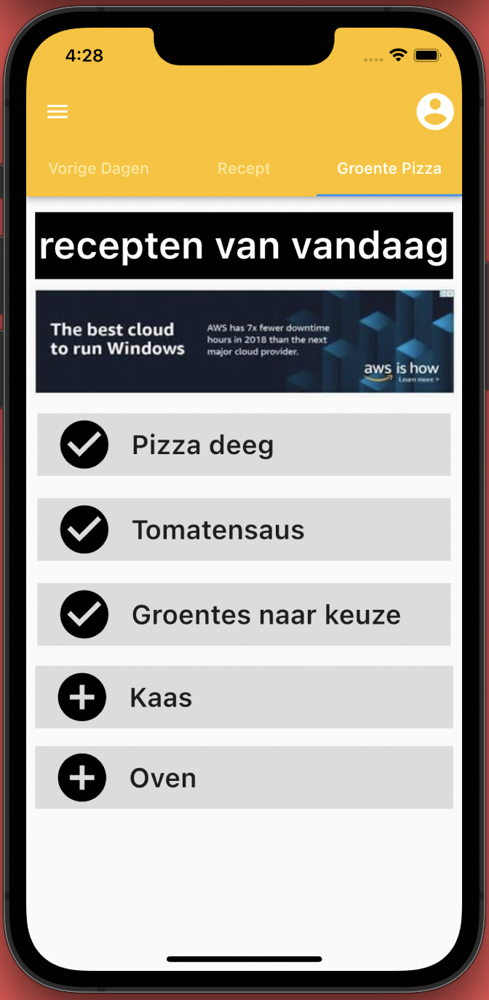
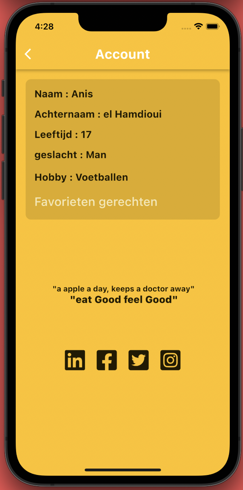
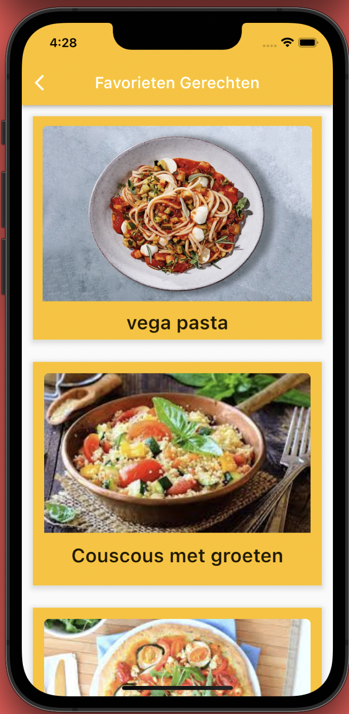

# Thuisgemaakt-Client-FlutterUI
A Food An Recipe Suggestion App with a Revenue Model for a client in Netherlands

## Screenshots

      

## Try out Thuisgemaakt?

Android: [Download Thuisgemaakt.apk]()

## Developer

Hi there! I am Mahedi Hasan Nabil. I create CrossPlatform apps for solving problems and Bringing something Enovative to make things easier to bring something new to the society. Try out my new app TeliMed(an online doctor consultation solution). 
If you have any query related to it don't hasitate to [e-mail me](mailto:mhnabilcoder@gmail.com). And also check out my other stuffs [here](https://github.com/mhnabilcoder).
